# Concepts

This chapter introduces the core concepts of AgentScope Runtime.

## Architecture

AgentScope Runtime uses a modular architecture with several key components:

```mermaid
flowchart LR
    %% Service modules
    subgraph Service["💼 Service"]
        MS["Memory Service"]
        SS["Session Service"]
        STS["State Service"]
        SBS["Sandbox Service"]
    end

    %% Sandbox modules
    subgraph Sandbox["🐳 Sandbox"]
        BS["Browser Sandbox"]
        FS["File System Sandbox"]
        GS["GUI Sandbox"]
        CSB["Cloud Sandbox"]
        MSB["Mobile Sandbox"]
        ETC["More..."]
    end

    %% Adapter modules (large block)
    subgraph Adapter["🔌 Adapter"]
        MAD["Memory Adapter"]
        SAD["Session Adapter"]
        STAD["State Adapter"]
        SBAD["Sandbox Tool Adapter"]
    end

    %% Agent modules (large block)
    subgraph Agent["🤖 Agent"]
        AG["AgentScope Java"]
        AG_NOTE["(More...)"]
    end

    %% Application layer
    subgraph AgentAPP["📦 Agent Application"]
        RA["Runner"]
    end

    %% Deployment modules
    subgraph Deployer["🚀 Deployer"]
        CT["Container Deployment"]
        KD["K8s Deployment"]
        DP["Cloud Deployment"]
        LD["Local Deployment"]
    end

    %% External protocols
    OAI["OpenAI Responses API SDK"]:::ext
    A2A["Google A2A Protocol"]:::ext
    CUS["Custom Endpoints"]:::ext

    MS --> MAD
    SS --> SAD
    STS --> STAD
    SBS --> SBAD

    BS --> SBS
    FS --> SBS
    GS --> SBS
    CSB --> SBS
    MSB --> SBS
    ETC --> SBS

    %% Large block to large block connections
    Adapter --> Agent

    AG --> RA
    RA --> CT
    RA --> KD
    RA --> DP
    RA --> LD

    %% Entire deployment module connects to external protocols
    Deployer --> OAI
    Deployer --> A2A
    Deployer --> CUS

    %% Styles
    classDef small fill:#0066FF,stroke:#004CBE,color:#FFFFFF,font-weight:bold
    classDef big fill:#99D6FF,stroke:#004CBE,color:#FFFFFF,font-weight:bold
    classDef ext fill:#FFFFFF,stroke:#000000,color:#000000,font-weight:bold

    class Tools,Service,Sandbox,Adapter,Agent,AgentAPP,Deployer big
    class RT,ST,PT,MS,SS,STS,SBS,BS,FS,GS,CSB,MSB,ETC,TAD,MAD,SAD,STAD,SBAD,AG,AG_NOTE,RA,CT,KD,DP,LD small

```

- **Agent**: The core AI component that processes requests and generates responses. In Runtime, it is recommended to use the AgentScope framework to build Agents.
- **AgentApp**: Serves as the entry point for agent applications, responsible for providing external API interfaces, route registration, configuration loading, and delegating requests to the Runner for execution.
- **Runner**: Orchestrates agent execution and manages deployment at runtime. It handles agent lifecycle, session management, streaming responses, and service deployment.
- **Deployer**: Deploys the Runner as a service, providing health checks, monitoring, lifecycle management, real-time response streaming using SSE, error handling, logging, and graceful shutdown.
- **Tool**: Provides out-of-the-box sandbox tool support.
- **Service**: Provides management services required by agents, such as memory management and sandbox management.
- **Adapter**: Adapters that adapt components/modules provided by Runtime to agent framework interfaces.

### Key Components

#### 1. Agent

`Agent` is the core component that processes requests and generates responses. There are already many development frameworks that include Agent classes. Runtime itself does not provide additional Agent classes. Developers can use AgentScope to develop the Agents they need.

#### 2. AgentApp

`AgentApp` is the **application entry point** in AgentScope Runtime, used to deploy Agents as API applications that can provide services externally.

Its responsibilities include:

- Initialize and bind **Agent** and **AgentScopeAgentHandler**, automatically build **Runner**, and delegate requests to the runtime for processing
- Provide standardized **HTTP API interfaces** (including health checks)
- Support **Server-Sent Events (SSE)** and standard JSON responses
- Allow registration of middleware, task queues (Celery), and custom routes
- Manage application lifecycle (support `before_start` / `after_finish` hooks)
- Deploy Agent applications as services

#### 3. AgentScopeAgentHandler

The `AgentScopeAgentHandler` class provides flexible and extensible agent execution logic. It manages:

- User-customizable request execution logic through `streamQuery`
- Streaming responses

#### 4. Deployer

`Deployer` (implemented as the `deployer-maven-plugin` plugin) provides production-grade deployment functionality:

- Automatically **build Docker images** during Maven packaging
- Optionally push to remote repositories, one-click deployment to **K8s clusters**, and deployment to **AgentRun**

#### 5. Sandbox & Tool

Runtime provides two ways to integrate tools:
- Ready-to-use tools, i.e., services provided by service providers that are ready to use out of the box, such as RAG
- Tool sandboxes, i.e., safe and controllable tools running in the runtime, such as browsers

#### 6. Service

`Service` includes the following types:

- `state_service` State service
- `memory_service` Agent memory service
- `sandbox_service` Sandbox service
- `session_history_service` Session history recording service

#### 7. Adapter

`Adapter` is categorized by different Agent frameworks and includes memory adapters, session adapters, message protocol adapters, etc.
