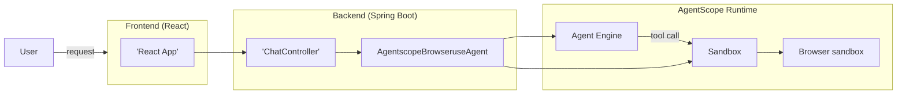

# Browser Use Demo 

[](LICENSE)


This demo showcases browser automation capabilities built on AgentScope Runtime, with a Spring Boot backend and a React frontend. Visualization is powered by [Steel-Browser](https://github.com/steel-dev/steel-browser).


## Project Structure

```bash
├── backend                        # Java backend (Spring Boot)
│   ├── src/main/java/io/agentscope/browser/
│   │   ├── BrowserAgentApplication.java     # Application entrypoint
│   │   ├── agent/AgentscopeBrowseruseAgent.java  # Browser agent implementation
│   │   ├── constants/Prompts.java          # System prompts
│   │   └── controller/ChatController.java  # OpenAI-like & A2A endpoints
│   ├── src/main/resources/application.yml  # Spring Boot config
│   └── pom.xml
├── frontend                       # React frontend
│   ├── public/                    # Static assets & HTML template
│   ├── src/                       # React source
│   ├── package.json
│   └── tsconfig.json
└── README.md                      # This file
```

## Features

- Browser navigation, form filling, page data extraction, and automated workflows
- Real-time visualization of browser actions
- OpenAI-compatible SSE streaming and A2A-protocol streaming

## Architecture



## Getting Started

### Prerequisites

1. Install Node.js
2. Install Java 17+
3. Install Maven 3.6+
4. Set DashScope API Key environment variable:

```bash
export DASHSCOPE_API_KEY=your_api_key_here
# or
export AI_DASHSCOPE_API_KEY=your_api_key_here
```

### Install and Run Frontend

```bash
cd frontend
npm install
npm run start
# The browser will open automatically, or visit http://localhost:3000
```

### Build and Run Java Backend

First build the parent project at repo root:

```bash
cd ../../..
mvn clean install -DskipTests
```

Then build and start the example backend:

```bash
cd examples/browser_use_fullstack_runtime/backend
mvn clean package

# Option 1: Run with Maven
mvn spring-boot:run

# Option 2: Run the JAR
java -jar target/browser-agent-backend-1.0.0.jar
```

Default port: 8080 (configurable in `application.yml`).

### Usage

1. Open http://localhost:3000
2. Enter a task, e.g., "Visit www.google.com and search for AgentScope"
3. The frontend will display browser actions and model outputs in real-time

## API Summary (Backend)

- Chat Completions (SSE): `POST /v1/chat/completions`, `POST /chat/completions`
- Browser Env Info: `GET /env_info`
- A2A Completions (SSE): `POST /a2a/`

## Logging & Troubleshooting

- Adjust log level (`application.yml`):

```yaml
logging:
  level:
    io:
      agentscope:
        browser: DEBUG
```

- Port conflict: set `server.port: 9000` (or other) in `application.yml` and update the frontend connection accordingly.
- Check API Key: `echo $DASHSCOPE_API_KEY`
- Docker (browser sandbox): ensure Docker is running: `docker ps`

## License

Apache 2.0

## Disclaimer

##### This project is for demonstration purposes only and not intended for production use.
