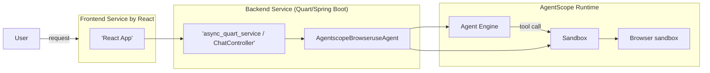

# Browser Use Demo

[](LICENSE)


This demo showcases how to use browser automation capabilities within the AgentScope Runtime framework. It provides both backend services and a frontend interface to demonstrate browser-based agent interactions. The real-time visualization of browser interactions is powered by [Steel-Browser](https://github.com/steel-dev/steel-browser).


## 🌳 Project Structure

```bash
├── backend                         # Python backend directory, containing server-side services and logic
│   ├── agentscope_browseruse_agent.py    # Script related to browser usage or agent management
│   ├── async_quart_service.py            # Asynchronous service using Quart to handle backend requests
│   └── prompts.py                        # Module containing prompt messages or interaction logic for the backend
├── backend_java                    # Java backend directory (alternative to Python backend)
│   ├── src/main/java/              # Java source code
│   │   └── io/agentscope/browser/
│   │       ├── BrowserAgentApplication.java   # Spring Boot main application
│   │       ├── agent/AgentscopeBrowseruseAgent.java  # Java agent implementation
│   │       ├── constants/Prompts.java         # System prompts
│   │       └── controller/ChatController.java # REST API endpoints
│   ├── src/main/resources/         # Configuration files
│   │   └── application.yml         # Spring Boot configuration
│   ├── pom.xml                     # Maven configuration
│   └── README.md                   # Java backend documentation
├── frontend                        # Frontend directory, containing client-side code (typically using React)
│   ├── public                      # Public folder for storing static files copied during build
│   │   ├── index.html              # HTML template for the frontend app, acts as the entry HTML file
│   │   └── manifest.json           # Manifest file describing the web app's metadata such as name and icons
│   ├── src                         # Source code folder, containing React components and styles
│   │   ├── App.css                 # Stylesheet for the main app component
│   │   ├── App.tsx                 # TypeScript file for the main app component, the root component of the application
│   │   ├── Browser.scss            # Stylesheet for specific browser-related components or pages using SCSS
│   │   ├── Browser.tsx             # React component file related to browser functionality
│   │   ├── index.css               # Global stylesheet affecting the overall look of the application
│   │   └── index.tsx               # Entry point for the React application to render content into `index.html`
│   ├── package.json                # Project dependencies file, lists all npm dependencies and scripts
│   └── tsconfig.json               # TypeScript configuration file, defines compilation options
└── README.md                       # Project documentation file, provides basic information and usage instructions
```

## 📖 Overview

This demo illustrates how agents can interact with web browsers to perform tasks such as:
- Web navigation
- Form filling
- Data extraction from web pages
- Automated web workflows

The implementation uses AgentScope's capabilities to create browser-based agents that can perform complex web interactions.

## ⚙️ Components

### Backend (Python)
- `agentscope_browseruse_agent.py`: Implements the browser-using agent with AgentScope Runtime
- `async_quart_service.py`: Provides asynchronous web service endpoints
- `prompts.py`: Contains prompts used by the agent for browser interactions

### Backend (Java)
- `BrowserAgentApplication.java`: Spring Boot application entry point
- `AgentscopeBrowseruseAgent.java`: Java implementation of the browser agent
- `ChatController.java`: REST API endpoints compatible with Python version
- `Prompts.java`: System prompts (same as Python version)

**Note:** Both backends provide identical HTTP APIs and can be used interchangeably with the frontend.

### Frontend
- React-based interface for visualizing browser interactions
- TypeScript implementation for type-safe code

## 🌵Architecture

The architecture of the demo is depicted in the following diagram (showing Python backend, Java backend has the same architecture):



## 🚀 Getting Started

You can choose to run either the **Python backend** or the **Java backend**. Both provide identical APIs and work with the same frontend.

### Preinstall

#### For Python Backend:
1. Install [Node.js](https://nodejs.org/en/)
2. Install [Python](https://www.python.org/) (version >= 3.11)
3. Set DashScope API key as environment variable

#### For Java Backend:
1. Install [Node.js](https://nodejs.org/en/)
2. Install [Java 17+](https://www.oracle.com/java/technologies/downloads/)
3. Install [Maven 3.6+](https://maven.apache.org/download.cgi)
4. Set DashScope API key as environment variable

### Install the Front-end Service

#### Install Node Packages

```bash
cd frontend
npm install
```

#### Run the Front-end Service

```bash
npm run start
```

This will open your browser and display the demo page. Alternatively, you can also open it in your browser at http://localhost:3000

### Option A: Install the Python Backend

#### Install Python Packages

```bash
cd backend
pip install -r requirements.txt
```

#### Run the Python Backend Service

```bash
python async_quart_service.py
```

The service will listen on port 9000.

### Option B: Install the Java Backend

#### Build the Parent Project

First, build the main AgentScope Runtime Java project:

```bash
cd ../../..  # Navigate to project root
mvn clean install -DskipTests
```

#### Build and Run the Java Backend

```bash
cd examples/browser_use_fullstack_runtime/backend_java

# Set your API key
export DASHSCOPE_API_KEY=your_api_key_here

# Build the project
mvn clean package

# Run the service
mvn spring-boot:run
# OR
java -jar target/browser-agent-backend-1.0.0.jar
```

The service will listen on port 9000.

For detailed Java backend documentation, see [backend_java/README.md](backend_java/README.md).

### Usage

1. Open your browser and navigate to http://localhost:3000.
2. Type your question in the input box and click the "Search" button, e.g., "Visit www.chinadaily.com.cn to search for today's hot topics."
3. The response will be displayed in the output box.

## 🛠️ Features

- Browser automation within the AgentScope Runtime framework
- Real-time visualization of browser actions
- Asynchronous processing for better performance
- React-based user interface
- TypeScript support for type safety

## ℹ️ Getting Help

If you have any questions or encounter any problems with this demo, please report them through [GitHub issues]().

## 📄 License

This project is licensed under the Apache 2.0 License - see the [LICENSE](LICENSE) file for details.

## 🍬 Disclaimers

This is not an officially supported product. This project is intended for demonstration purposes only and is not suitable for production use.
